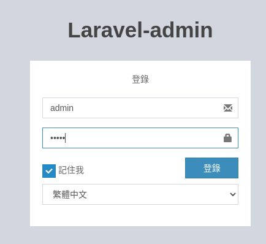
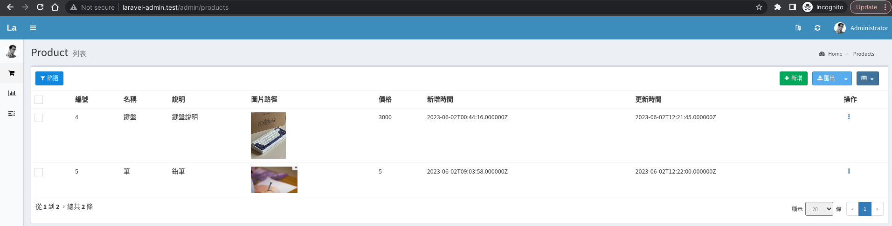
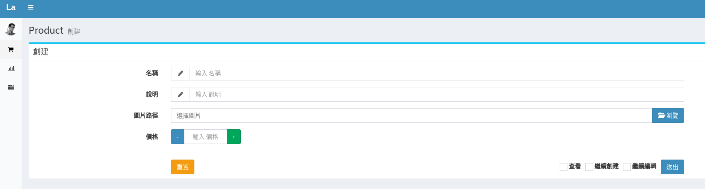
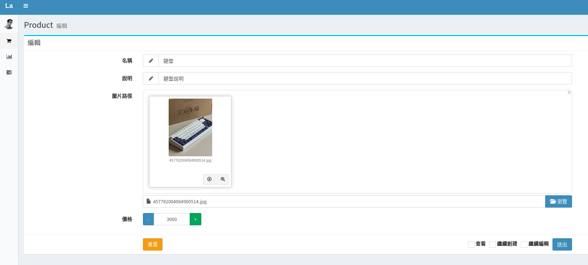
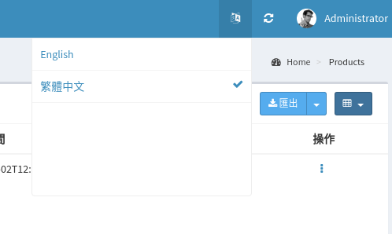
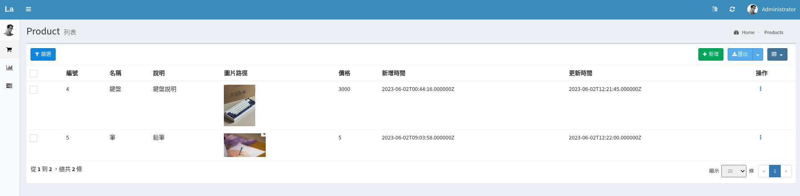
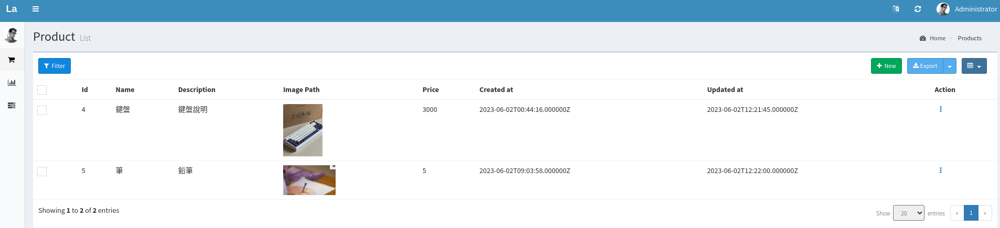

## 快速上手
1. setting .env  file

2. init
```bash 
composer install 
php artisan admin:install 
php artisan migrate 
```

## 商品結構

### Model: Product

| 欄位         | 屬性  | 說明  | 
| ----------- | --- |---|
| name        | varchar(50)  | 商品名稱  |
| description | varchar(300) | 商品介紹  |
| image_path  | varchar(100) | 圖片路徑  |
| price       | int(11)      | 價格     |

## demo 

### 登入頁
Route: `/admin`  

> 後台帳號密碼預設 admin | admin

### 商品列表
Route: `/admin/products`


### 商品新增 / 編輯



### 多語系
使用套件 `laravel-admin-extensions/multi-language` 設定多語系，  
並且可以於選單上選擇語系  
   

- 中文
   

- 英文
   
